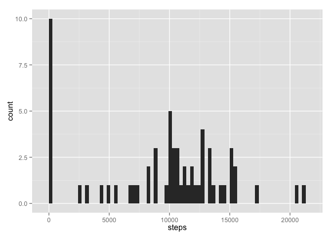
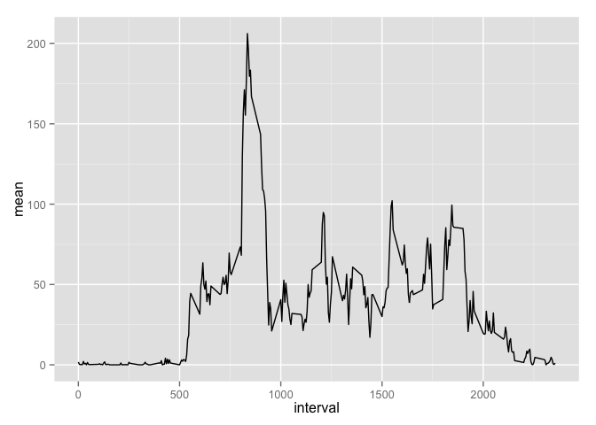
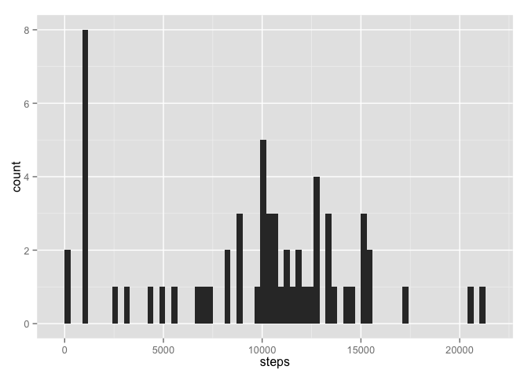
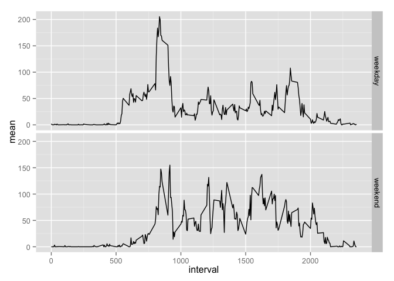

# Reproducible Research: Peer Assessment 1
Evgeny Vasilyev  
*please note that presented code reqires plyr and ggplot libraries*


## Loading and preprocessing the data


```r
#reading data
setwd ("/Users/evgeny/Documents/DataScience/05_RR/Week1/RepData_PeerAssessment1")
unzip("activity.zip")
basicdata <- read.csv("activity.csv")
#set POSIXct format for dates
basicdata$date <- as.POSIXct(basicdata$date)
```
## What is mean total number of steps taken per day?

```r
databyday <- aggregate(basicdata$steps, by = list(basicdata$date), sum, na.rm = TRUE)
names(databyday) <- c("date","steps")
qplot(steps, data = databyday, binwidth = 300)
```



```r
dstepsmn <- mean(databyday$steps)
dstepsmdn <- median(databyday$steps)
```
Mean is:

```
## [1] 9354.23
```
Median is:

```
## [1] 10395
```
## What is the average daily activity pattern?

```r
intstepsmn <- aggregate(basicdata$steps, by = list(basicdata$interval), mean, na.rm = TRUE)
intstepsmed <- aggregate(basicdata$steps, by = list(basicdata$interval), median, na.rm = TRUE)
intmnmeddata <- cbind(intstepsmn,intstepsmed$x)
names(intmnmeddata) <- c("interval","mean","median")
ggplot(intmnmeddata, aes(x = interval, y = mean)) + geom_line()
```



Average daily activity pattern presented on plot


```r
maxstepsint <- intmnmeddata$interval[intmnmeddata$mean == max(intmnmeddata$mean)]
```
The max mean of steps equals: 

```
## [1] 835
```

## Imputing missing values

```r
nadata <- is.na(basicdata$steps)
nanum <- length(nadata)

nafix <- data.frame(date = basicdata$date[is.na(basicdata$steps)], interval = basicdata$interval[is.na(basicdata$steps)], steps = intmnmeddata[match(intmnmeddata$interval,basicdata$interval[is.na(basicdata$steps)]),3])

basicdata2 <- subset(basicdata,!is.na(basicdata$steps))
basicdata2 <- rbind(basicdata2,nafix)

databyday2 <- aggregate(basicdata2$steps, by = list(basicdata2$date), sum, na.rm = TRUE)
names(databyday2) <- c("date","steps")
qplot(steps, data = databyday2, binwidth = 300)
```



```r
dstepsmn2 <- mean(databyday2$steps)
dstepsmdn2 <- median(databyday2$steps)
```

By this code I've put median into NA data for steps. The calculations for new data swowed that mean steps value changed not significantly (9503 versus 9354), and median stays the same.

## Are there differences in activity patterns between weekdays and weekends?

```r
basicdata2$weekd <- ifelse(weekdays(basicdata2$date) == "Saturday" | weekdays(basicdata2$date) == "Sunday","weekend","weekday")
intstepsmn2 <- aggregate(basicdata2$steps, by = list(basicdata2$weekd,basicdata2$interval), mean, na.rm = TRUE)
intstepsmed2 <- aggregate(basicdata2$steps, by = list(basicdata2$weekd,basicdata2$interval), median, na.rm = TRUE)
intmnmeddata2 <- cbind(intstepsmn2,intstepsmed2$x)
names(intmnmeddata2) = c("weekday","interval","mean","median")

ggplot(intmnmeddata2, aes(x = interval, y = mean)) + geom_line() + facet_grid(weekday~.)
```


Yes, there's a little difference, you can see it on plot
